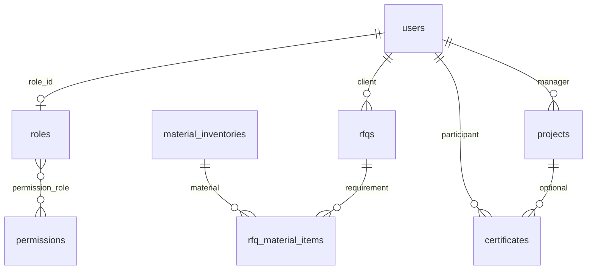
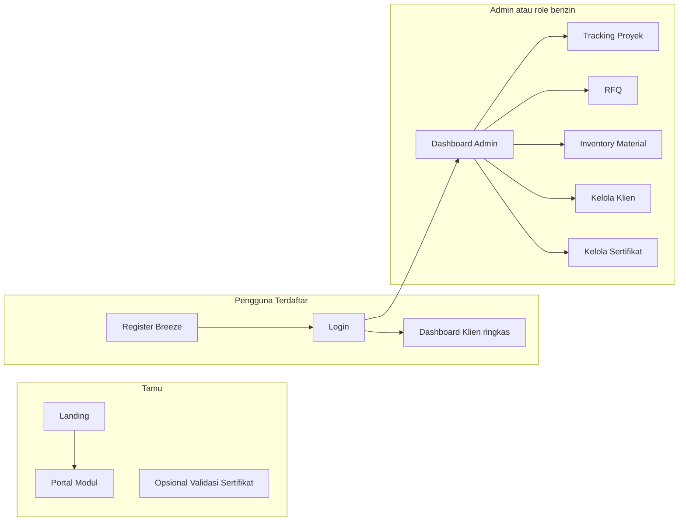

# Rencana Project: Integrated Operational System (Skripsi)

## Konteks codebase

- Stack saat ini: **Laravel 12**, **Laravel Breeze** (auth), **Vite + Tailwind** ([composer.json](composer.json)).
- Routing: [routes/web.php](routes/web.php) masih default (`/`, `/dashboard`, profil). Belum ada model domain atau **Role/Permission** di `app/` (grep kosong).
- Migrasi: hanya `users`, `cache`, `jobs` ([database/migrations](database/migrations)).
- Template RBAC yang harus diikuti: [docs/ROLE_PERMISSION_TEMPLATE.md](docs/ROLE_PERMISSION_TEMPLATE.md) — pola `users.role_id`, pivot `permission_role`, `Gate::define('permission', ...)`, middleware `permission:<code>`, seeder berurutan.

## Deliverable dokumen

Dokumen ini adalah sumber kebenaran untuk skripsi + tim.

---

## 1. Ruang lingkup skripsi (sederhana, tidak over-engineer)

| Modul                          | Fokus di skripsi                      | Catatan                                                                 |
| ----------------------------- | ------------------------------------- | ----------------------------------------------------------------------- |
| Project Management System     | Monitoring status & timeline proyek   | CRUD proyek sederhana + update status + catatan progres                 |
| Sales and Inventory System    | RFQ + stok material                   | RFQ mengacu klien + judul kebutuhan, terhubung ke inventory material    |
| PTS Digital Portal (guest)    | Informasi layanan & akses akun        | Landing + halaman modul publik, login/register Breeze tetap digunakan   |
| Training Management System    | Sertifikasi & validasi                | Sertifikat dipisahkan sebagai menu sendiri di admin                     |

Asumsi **“2 halaman tamu”**: dua halaman **marketing/publik** ber-layout sama (bukan menghitung login/register):

1. **Beranda / Landing** — penjelasan layanan, CTA ke register/login/katalog.
2. **Portal modul publik** — ringkasan modul sistem dan alur akses pengguna (read-only).

Halaman auth Breeze (`login`, `register`) tetap ada; tidak dihitung sebagai “2 page” utama agar fokus skripsi jelas.

Jika Anda ingin **tepat dua URL saja** untuk seluruh publik (tanpa subhalaman katalog terpisah), bisa digabung Landing + blok katalog dalam satu halaman — sesuaikan saat implementasi; struktur data tetap sama.

---

## 2. Data master vs transaksi (sesuai ringkasan Anda)

### 2.1 Master

- **Klien / peserta** — dipetakan ke `users` (satu akun) + opsional tabel `client_profiles` jika perlu field perusahaan/alamat ekstra; minimal: nama, email, telepon, alamat, `category` (individu/korporat/internal), `status`, **audit** `created_at`, `updated_at`, `created_by`, `updated_by`.
- **Inventory Material** — `material_inventories`: kode material, spesifikasi, UoM, saldo stok, minimum stok, biaya satuan, status aktif, audit.
- **Proyek** — `projects`: nama, scope teks, `start_date`, `end_date`, `manager_user_id` (FK users), audit.

### 2.2 Transaksi

- **RFQ / penawaran** — `rfqs` atau `transactions`: `client_id` (user), `request_title`, nilai, tanggal, status enum.
- **Kebutuhan material RFQ** — `rfq_material_items`: relasi RFQ dengan material, kuantitas kebutuhan, estimasi biaya.
- **Sertifikat** — `certificates`: `participant_id` (user), `project_id` nullable, tanggal terbit, masa berlaku, path/url file, kode validasi unik, audit.

### 2.3 Prinsip

- Normalisasi: transaksi menyimpan FK, bukan duplikasi alamat/nama panjang.
- Integritas: hapus produk/proyek hanya jika tidak melanggar FK — atau **soft delete** + constraint; untuk skripsi cukup policy “cek relasi dulu” di controller.
- Audit trail pada entitas master (dan bisa pada transaksi penting).

### 2.4 ERD ringkas (konsep)

---

## 3. Alur fitur (ringkas, alur skripsi)

- **Registrasi online**: form Breeze → user + role `customer` (di seeder / event RegisteredUser).
- **PTS Digital Portal (guest)**: tamu melihat landing + ringkasan modul sistem.
- **RFQ**: klien (atau admin atas nama) buat penawaran → admin ubah status.
- **Inventory Material**: admin memonitor saldo & minimum stok; RFQ menampilkan referensi status material LOW/OK.
- **Tracking proyek**: admin update status/tanggal/milestone sederhana (bisa satu field `status` + `notes`).
- **E-Certificate**: admin input → file disimpan di `storage` → peserta lihat di dashboard atau link; opsional halaman publik cek kode.

---

## 4. Role dan permission (mengikuti template)

Implementasi teknis seperti [docs/ROLE_PERMISSION_TEMPLATE.md](docs/ROLE_PERMISSION_TEMPLATE.md):

- Migrasi: `roles`, `permissions`, `permission_role`, `users.role_id`.
- Model: `User::hasPermission`, `Role::hasPermission`, `Gate::before` super admin, middleware `EnsureUserHasPermission`, alias `permission` di `bootstrap/app.php`.
- **Jangan** hardcode nama role untuk hak fitur; gunakan `code` permission.

**Konvensi `module.action`** untuk domain skripsi (contoh — disesuaikan di `PermissionSeeder`):

- `dashboard.view`
- `project.view`, `project.create`, `project.update`
- `rfq.view`, `rfq.create`, `rfq.update`, `rfq.delete`
- `inventory.view`, `inventory.create`, `inventory.update`, `inventory.delete`
- `client.view`, `client.update` (data klien pasca registrasi)
- `certificate.view`, `certificate.create`, `certificate.update`, `certificate.validate` (jika route validasi publik dilindungi tidak perlu; publik bebas)

**Mapping role (disarankan untuk skripsi):**

| Role code     | Uraian singkat                                                                                              |
| ------------- | ----------------------------------------------------------------------------------------------------------- |
| `super_admin` | Semua permission (bypass gate)                                                                              |
| `admin`       | Operasional penuh kecuali role/user sistem (opsional)                                                       |
| `marketing`   | RFQ + lihat inventory                                                                                        |
| `customer`    | Akses terbatas: RFQ sendiri, lihat sertifikat sendiri (bisa via gate resource sederhana atau cek `user_id`) |

Detail mapping `sync` di `RoleSeeder` mengikuti pola template (`Permission::whereIn('code', ...)`).

---

## 5. UI: base website, 2 halaman tamu, admin

### 5.1 Base / tema

- **Warna primer**: `#0d7f7a` — dipakai untuk header, tombol primer, link aktif (Tailwind: extend theme atau arbitrary `bg-[#0d7f7a]` / `text-[#0d7f7a]`).
- **Ikon**: **Font Awesome** saja (CDN CSS di layout, mis. FA6) — semua ikon memakai kelas `fa-*` / `fa-solid` sesuai permintaan.
- **Layout tamu baru** mis. `resources/views/layouts/site.blade.php`: navbar (logo, link Beranda, Katalog, Login/Register), footer, slot konten, `@vite` tetap.
- **Layout admin** mis. `resources/views/layouts/admin.blade.php`: sidebar/topbar dengan menu yang dibungkus `@can('permission', '...')` — mengikuti pola sidebar di template (opsional file terpisah).
- **Menu admin**: pisah menu sesuai 4 modul inti (Project Management, Sales & Inventory, PTS Portal, Training Management).

### 5.2 Dua halaman tamu (MVP)

- `GET /` → view landing (hero, 5 layanan dengan ikon FA, CTA).
- `GET /katalog` (atau `/catalog`) → ringkasan 4 modul inti untuk pengunjung.

### 5.3 Admin

- Prefix route `Route::prefix('admin')->middleware(['auth', 'verified'])` + grup permission per controller.
- Dashboard ringkas: kartu jumlah proyek, RFQ pending, inventory material, sertifikat terbaru.
- Modul CRUD minimal per entitas dengan policy/gate di controller.
- Inventory basic: saldo stok, minimum stok, status LOW/OK, dan relasi item material pada RFQ.

### 5.4 Breeze

- Pertahankan [resources/views/layouts/app.blade.php](resources/views/layouts/app.blade.php) untuk area **dashboard pengguna**; sesuaikan warna/ikon agar konsisten dengan situs atau pisahkan “dashboard klien” vs “admin” lewat layout berbeda.

---

## 6. File / area utama yang akan disentuh saat implementasi

- `database/migrations/*` — domain + RBAC.
- `app/Models/*` — `Role`, `Permission`, `Project`, `Rfq`, `Certificate`, `MaterialInventory`, `RfqMaterialItem`, extend `User`.
- `app/Http/Controllers/*` — Guest (Home, Catalog), Admin namespace.
- `app/Providers/AppServiceProvider.php` — Gate (sesuai template).
- `app/Http/Middleware/EnsureUserHasPermission.php` — baru.
- `bootstrap/app.php` — alias middleware `permission`.
- `database/seeders/PermissionSeeder.php`, `RoleSeeder.php`, `AdminUserSeeder.php`, `DatabaseSeeder.php`.
- `routes/web.php` — grup publik, admin, tetap `auth.php`.
- `resources/views/layouts/site.blade.php`, `admin.blade.php`, + view halaman tamu dan admin.
- `resources/css/app.css` — variabel warna primer jika dipakai.

---

## 7. Urutan implementasi yang disarankan

1. RBAC penuh (migrasi + model + gate + middleware + seeder) — verifikasi login admin vs customer.
2. Migrasi master + transaksi + seed data demo.
3. Layout `site` + Landing + Katalog publik (#0d7f7a + FA).
4. Controller admin + blade + `Gate::authorize` per aksi.
5. Alur registrasi: assign role `customer` + halaman profil/klien opsional.
6. (Opsional) Validasi sertifikat publik + penyimpanan file.

---

## 8. Catatan perubahan implementasi (15 April 2026)

- Produk tidak lagi menjadi modul inti; route admin produk dilepas dari menu dan alur utama.
- RFQ direfaktor agar tidak bergantung ke `product_id`, diganti `request_title`.
- Struktur sidebar admin dipisah sesuai 4 modul inti:
  - Project Management System
  - Sales and Inventory System
  - Master Data (akun guest/klien)
  - Training Management System (sertifikasi menu tersendiri)
- Halaman publik `katalog` disesuaikan menjadi ringkasan modul sistem, bukan daftar produk.
- Seeder permission/role disesuaikan agar mapping tidak lagi membutuhkan permission produk.
- Penyesuaian sidebar lanjutan: menu `Digital Portal` dihapus, akun guest dipindah ke grup `Master Data`.
- Standarisasi layout form admin: semua card form diubah menjadi `w-full` (tanpa `max-w-*`).

## 9. Risiko / batasan skripsi

- Tidak perlu microservices, queue kompleks, atau notifikasi real-time kecuali satu contoh sederhana.
- Fokus demonstrasi: data terstruktur, hak akses jelas, alur RFQ–proyek–sertifikat konsisten dengan ERD.
